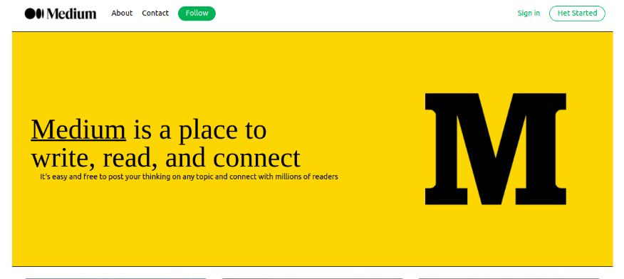

# Medium-blog-app

### [Site link](https://medium-next-app.vercel.app/)

<kbd>
  
</kbd>

### 🛠 The tech stack is:

- [Nextjs](https://nextjs.org/)
- [React](https://reactjs.org/)
- [TypeScript](https://www.typescriptlang.org/)
- [Tailwindcss](https://tailwindcss.com/docs/guides/create-react-app)
- [sanity.io](https://www.sanity.io/)
- [eslint](https://eslint.org/)
- [react-hook-form](https://react-hook-form.com/)
- [Flexbox](https://en.wikipedia.org/wiki/CSS_Flexible_Box_Layout)
- [Grid](https://developer.mozilla.org/ru/docs/Web/CSS/CSS_Grid_Layout/Basic_Concepts_of_Grid_Layout)

